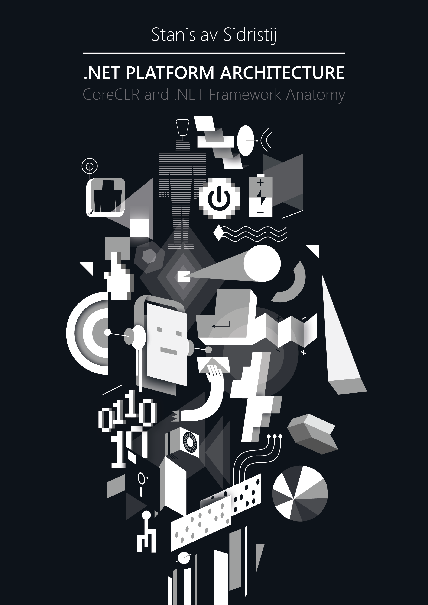

## This book is available in English, Русском and 中文:

  - If you want to show that you like this book or to express your gratitude to author, Star this project, Fork it and Pull Requests to it.
  - Если вы хотите показать, что книга вам нравится или выразить благодарность, ставьте звезду проекту, делайте fork и создавайте Pull Requests!
  - 如果你想表明你喜欢这本书或者表达你对作者的感激之情，点击一个星星。

Cover | From Author, Stanislav Sidristij
-------|-----
 | This book was thought as a full description of how .NET CLR and to some extent .NET Framework function. I tried to draw reader's attention to their internals from a different, unusual point of view. Primarily, it is caused by statement — quite disputable — that any software developer  must know C/C++. Why? The reason is that among all high-level languages these are the nearest to the CPU, and if you build your program in these languages you feel better how it runs. However, our world looks different than we expect and we often have no time to learn things we won't use; that's why I decided to write this book where issues are explained deeper than usual and with a more intricate or alternative examples. Beyond their standard goal — to show a specific functionality with a simple code — these examples pave the way to alternative reality by showing that things may turn out to be more complicated than they seem. With that in mind, you will feel how every single cog works in CLR. If you want to show that you like this book or to express your gratitude to author, star this project, fork it and pull requests to it.
 | Эта книга задумана мной как максимально полное описание работы .NET CLR, и частично - .NET Framework и призвана в первую очередь заставить посмотреть читателя на его внутреннюю структуру под несколько другим углом: не так, как это делается обычно. Связано это в первую очередь с утверждением, которое может показаться многим очень спорным: любой разработчик обязан пройти школу C/C++. Почему? Да потому что из высокоуровневых эти языки наиболее близки к процессору, и программируя на них начинаешь чувствовать работу программы сильнее. Однако, понимая, что мир устроен несколько иначе и у нас зачастую нет никакого времени изучать то, чем мы не будем напрямую пользоваться, я и решил написать эту книгу, в которой объяснение всех вопросов идет с более глубокой чем обычно - позиции и с более сложными или же попросту альтернативными примерами. Которые, помимо своей стандартной миссии - на самом простом коде показать как работает тот или иной функционал, сделать реверанс в альтернативную реальность, показав что все сильно сложнее чем может показаться изначально. Зачем? Чтобы и у вас возникло чувство понимания работы CLR до последнего винтика
 | 本书是我对.NET CLR工作的最全面描述，部分是.NET Framework，主要是为了让读者从一个稍微不同的角度看待它的内部结构：不是通常的方式。这主要是因为这个声明对许多人来说似乎很有争议：任何开发人员都必须通过C / C ++学校。为什么呢？是的，由于更高级别的语言，这些语言最接近处理器，并且在其中编程，您开始感觉到程序的工作更强大。然而，我意识到这个世界有些不同，而且我们经常没有时间研究我们不会直接使用的东西，所以我决定写这本书，其中所有问题的解释来自比平时更深的位置，而且更复杂或者只是替代的例子。除了他们的标准任务之外 - 在最简单的代码上，展示这个或那个功能是如何工作的，对一个替代现实做出一种屈膝的态度，表明一切都比最初看起来要复杂得多。为什么呢？这样你就能理解CLR到最后一个螺丝的工作
wwwwwwwwwwwwwwwwwwwwwwwwwww|